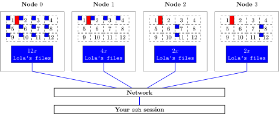

>## Preface
>
>Whenever large corporate or academic institutions acquire large super computers, the competition to obtain time to run programs is typically fierce. On the other hand, expectations by users are high, that their code will run very fast and provide them with answers to their scientific questions at a high turn-around time. As supercomputers are multi-purpose machines, they are required not only to provide good or even excellent performance, but also that they distribute this performance among all users in a fair manner.
>
>On a laptop or workstation any request for CPU time is immediately handled by the operating system. Just click any link on this page and the OS will immediately hand your request through to the CPU, which in turn will execute the routines and functions required to ask the server what contents lie behind the link that you just clicked. If a super computer would operate like this, very soon, nobody would use it anymore. The reason is that typically your laptop or workstation is a computational resource that is used mostly by one user only. This user's requests will be handled mostly. 
>
>A super computer is a shared resource. Many users can log into it at the same time and work on your code, perform computations of a wide variety and perform operations on files and folders at the same time as well. In order to prevent clashes of tasks that required time on the machine exclusively, every action on the cluster needs to be described first to the scheduler. The latter is a piece of software that decides which one of these tasks should run on which computer. This is best explained with an example.
>
>

Lola's lab has just bought a 4-node cluster for their sole use. Each individual computer in the cluster (also called a node) has 12 CPU cores, some memory and a connection to a network that all nodes are members of and can hence communicate by. This is by far much more hardware than the group has ever managed before. The setup is different from the cluster at the IT department that Rob started to introduce her to.

She and her colleague start to run calculations on the machine. Lola wants to analyze some files that are scattered across the cluster. By chance, one machine has 12 files that need to be analyzed.

Lola's colleague has the task to check on the cluster every now and then. This colleague wrote a program, that collects some telemetry data from each node every now and then. Today, some detailed statistics have to be collected from every node. As this task can be performed for every node independent of it's neighboring node, it is performed in parallel.

Both now wonder why the tasks on node 0 take longer than on average on any other given day. The reason is, the Lola's jobs there require all 12 CPU cores to run. If a new job comes in and wants to perform a task, the node has to decide which task has the higher priority. For sure, this decision is not made based on the sender of task but on other parameters. Operating systems (just as schedulers) try to distribute the compute power of a machine in a fair share fashion as well. But that means, that these two tasks will take longer than expected as they block each other or they steal each others resources.

For this, a _scheduler_ is put in place that manages these tasks. It accepts task (or better 'a _job_') descriptions, based on the current usage of the nodes it can then decide when a task is launched (or _dispatched_ or _spooled_) on a node. The scheduler also helps treating the output of a job to the terminal and write it to a file.

The cluster in question here, is running a scheduling software called {{ site.workshop_scheduler }} (a scheduler is also referred to as _batch system_). After this incident, Lola approaches her lab mate and they both decide to give the batch system a try.

A first exercise would be to submit a job that does nothing else but print "Hello World!".

~~~

~~~
{: .bash}

~~~
Hello World
~~~
{: .output}

That worked out pretty well. The problem is, it's not very helpful and doesn't help Lola or anyone to do her job. But Lola wonders if the job really was executed on another node. She thinks of a little experiment to explore the scheduler a bit. 

~~~

~~~
{: .bash}

~~~
n01
~~~
{: .output}

If she repeats this command, over and over again, the output changes. So these commands must be running on another node. 

> ## Editing a file on a remote machine
> If you are following the materials closely, this is the time where you might want to edit a file on your cluster and paste the contents of the code snippet above into it. The question is, how to do that?
>
> You have several options: 
> 1. run a editor inside the `ssh` session that you opened to work on the cluster (mostly vi/vim, emacs, nano or pico are programs commonly installed on HPC machines)
> 2. connect to the cluster with `ssh` using the ssh `-X` switch, if done so, you can open editors like emacs, nedit, gedit, ... that are capable of spinning up a GUI (careful though, the GUI contents need to be transmitted through the network from the cluster to your workstation or laptop and vice verse, so in case you have a poor network connection, this approach can be visually painful)
> 3. use remote editing capabilities of your preferred editor or IDE (emacs and vim has a built-in packages for this, check your preferred IDE manual for details)
> 4. have a folder of your remote host mounted on your laptop (the details depend on the remote cluster and you should get in touch with the admin to find out what technologies are available), edit the files inside this folder (most of the time they are updated to the cluster in real-time) and launch the applications from your `ssh` session

Individual commands are fine, but Lola knows from experience that very often her work requires her to do more complex tasks, i.e. to execute a couple of commands after one another. To simulate this, she writes a small script that can be run on the node that runs her job.  

~~~

~~~
{: .bash}

~~~
n02
Tue Mar  7 11:04:11 CET 2017
~~~
{: .output}

OK, but Lola wonders where the output of the job goes. Is there a way to reliably store the output of the command permanently? Reading the documentation of the submit command, she finds out that the output of her command can be stored into a file of Lola's liking.

~~~

~~~
{: .bash}

Once the job is done, the file `multiple_commands.log` is created in the current directory and yields the following output:

~~~
n12
Tue Mar  7 11:14:11 CET 2017
~~~
{: .output}

> ## Errors are important as well
> The *nix operating systems has some special quirks to it. One of it is, that there is not only one way to print something to the terminal. There is the so called standard output and standard error output. Text that is sent to one of them is not seen by the other. Typically, error messages are sent to the standard error (the word output is often omitted) and status messages are sent to standard output. When executing commands on the command line, the difference between the two ways is not noticeable. The scheduler however allows you to split the two and write them to individual files. For example like this:
~~~

~~~
{: .bash}
{: .callout}

> ## How long has this node been running
>
> Write a batch script that prints the `hostname` and the time the node has been running so far (using the `uptime` command). Advice the scheduler to store the output in a log file. Submit this script multiple times and see, if you find a node that has been running the longest or the shortest. Compare with your neighbor! 
>
{: .challenge}
